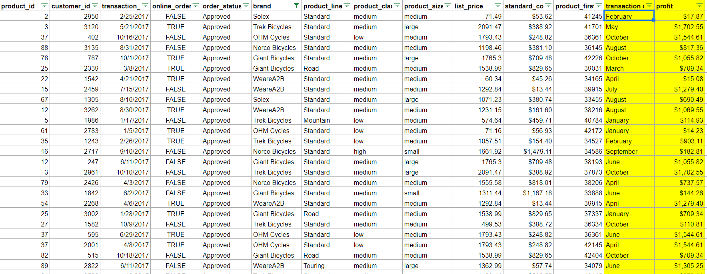
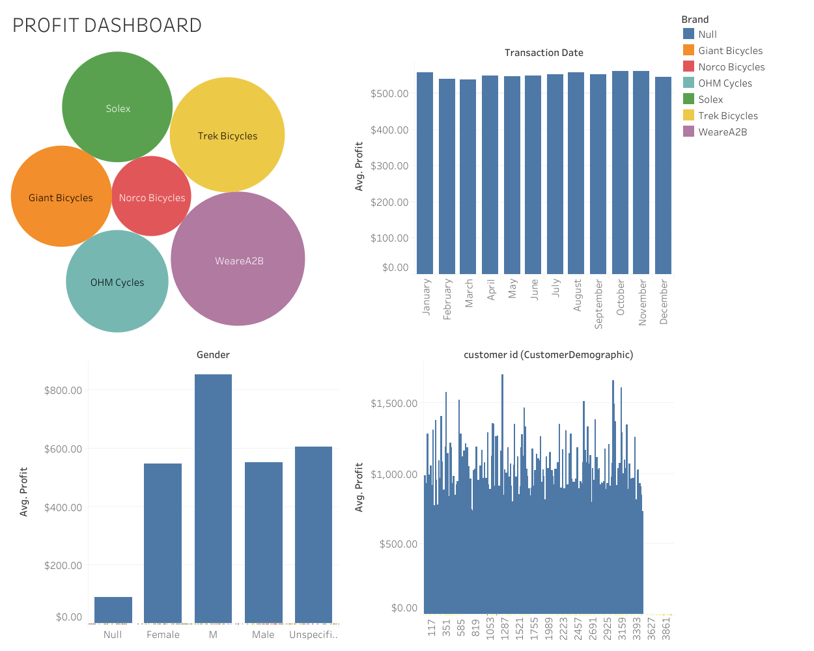

In this KPMG task we have to work on three datasets which is povided by "Sprocket pvt limited" company. The datasets provided is listed below,
1. Customer Demographic.
2. Transaction.
3. New Customer List.

TASK 1. In this task we have to analyse the datasets for any null values, any missing values, also added more columns as "transaction" and "profit" in dataset because it is not given in the datasets. Then i replaced gender data because it is given in messy form.

TASK 2. In this task we have write an "email" to company which includes all the issues related to dataset for example missing data, missing columns like transaction and profit etc. also i include some recommendations to company in this email.

TASK 3. In this task we have to create "dashboard" which contains all information about profit.

The tools used in this work is listed below,
1. MS Excel
2. Tableau Software.
3. MS Word
